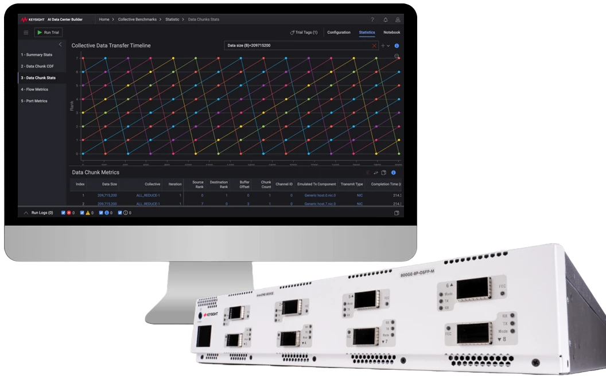

[][kaidcb_product_page]

The [Keysight AI Data Center Builder][kaidcb_product_page] (KAI DC Builder) is a robust evaluation and benchmarking solution that helps you improve interconnect performance in AI/ML systems. Designed for fast deployment and streamlined operations, it provides deep insights into performance characteristics of backend network fabrics to identify bottlenecks, increase throughput, and optimize the overall efficiency of your AI systems.

To accelerate AI/ML network design, the KAI DC Builder:

* **Emulates realistic high-scale AI workloads** – Reduce dependency on large GPU clusters for infrastructure experimentation and validation.
* **Simplifies the benchmarking process** – Validate AI network fabric with pre-packaged benchmark applications and dataset analysis tools.
* **Offers a choice of test engines** – Choose between (1) RoCEv2 endpoint emulation on high-density AresONE traffic load appliances, (2) software endpoints on serves equipped with RDMA NICs, or (3) real AI accelerators.

The solution can complement, minimize or even replace GPU usage in AI cluster infrastructure performance testing, enabling AI operators to reduce the spend they would otherwise allocate entirely to GPU-based benchmarking systems.

[kaidcb_product_page]: https://www.keysight.com/us/en/products/network-test/protocol-load-test/kai-data-center-builder.html
