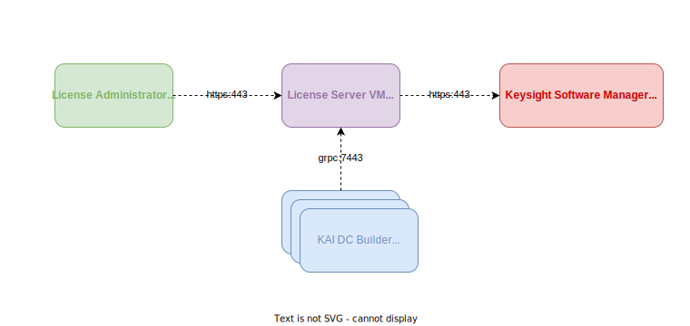

# Architecture

## Components

The KAI Data Center Builder has the following components:

1. Distributed System Experiments (DSE) Controller – the central component with user-facing Web UI as well as the DSE API
2. Data Flow Emulation (DFE) Plugin – uses Keysight AresONE hardware or Linux hosts with RDMA NICs as RDMA endpoints
3. DSE Storage – persistent storage of trial configurations and results
4. Primary DFE Host – host designated to run DFE Redis database, applicable to Keysight Software option only

## System Diagrams

### Keysight Hardware

Diagram of the system running on AresONE traffic generator (Keysight Hardware)

### Servers with RDMA NICs

Diagram of the system running on Servers with RDMA NICs (Keysight Software)

### License Server

Diagram of the DSE Controller and License Server communication

