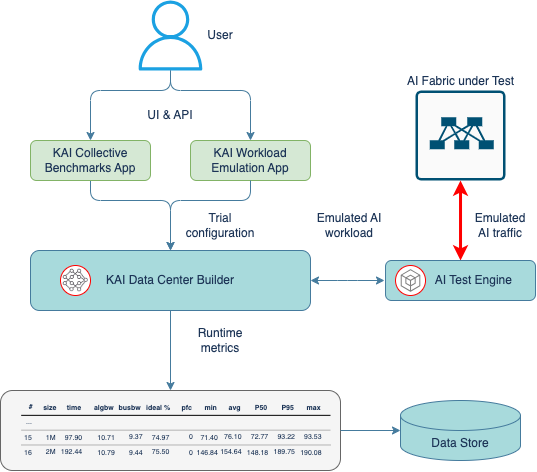
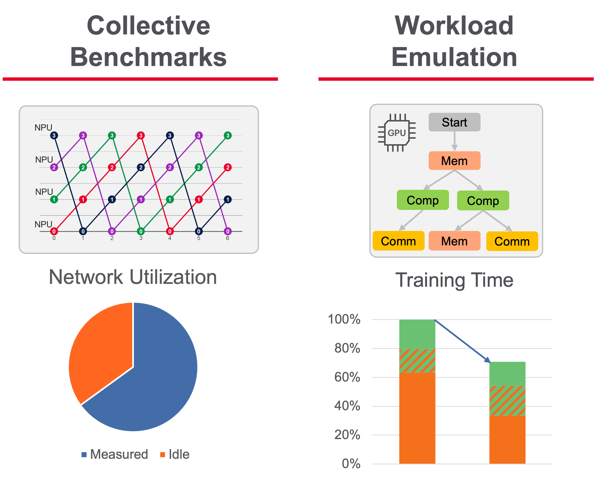
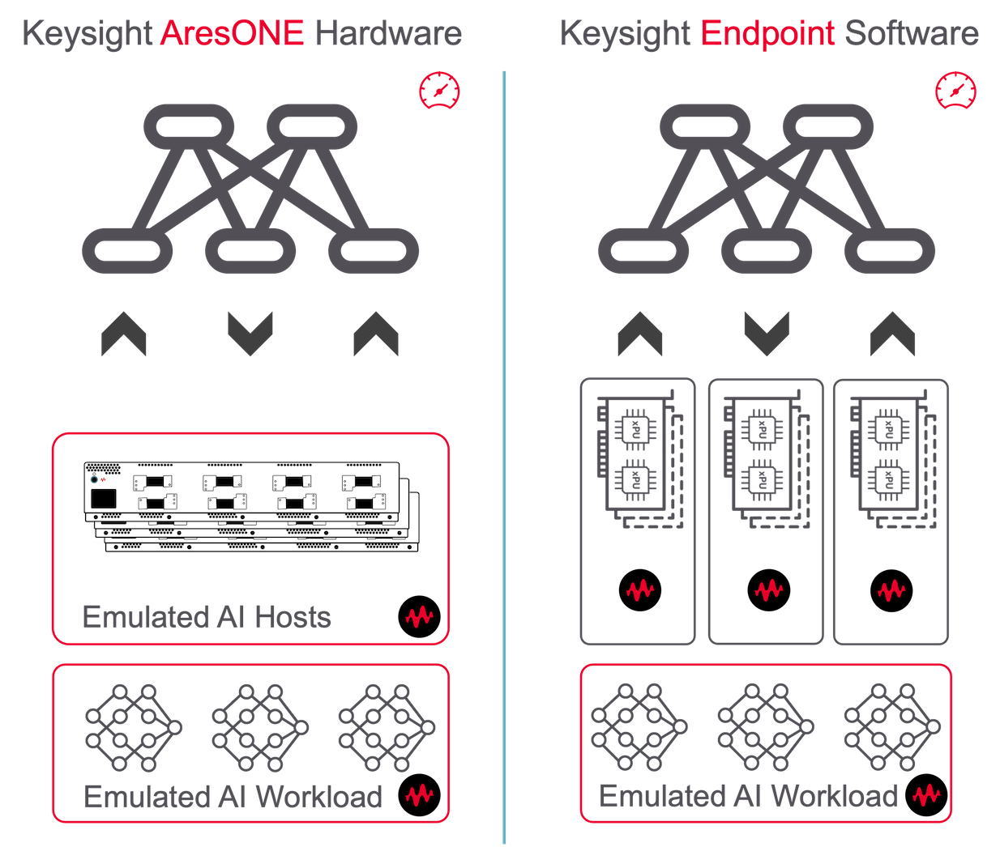

# Introduction

The KAI DC Builder enables users to host and run applications that specialize in measuring and/or analyzing various aspects of the AI infrastructure.

The role of the applications is to collect a dataset by executing a Trial. Each application has its own way to define the objective of the Trial, initialize it with the application-specific Trial Configuration and report results based on the collected dataset. You can interact with the KAI DC Builder apps via the web-based user interface for visual, user-driven workflow, or use automation scripts for batch execution from an unattended continuous integration pipeline.

There are two applications currently available:

* KAI Collective Benchmarks
* KAI Workload Emulation

**KAI Collective Benchmarks** runs performance micro-benchmarking for distributed communications algorithms commonly used in scaled-out AI systems called collective communications. The typical objective of using the Collective Benchmarks app is to make sure the network is capable of providing the optimal and consistent bandwidth for a range of data exchanges expected from the distributed AI jobs.

**KAI Workload Emulation** replays short sequences of steps real AI workloads, like pre- or post-training, go through over the course thousands and millions of iterations called epochs. These workloads form a mix of computational and communication steps, mostly defined by the type of AI model partitioning schemas to distribute the job across hundreds or thousands of GPUs. The Workload Emulation app provides a way to experiment with the performance of the model partitioning choices over various types of network topologies. It helps to find an optimal combination that would minimize the time spend on moving the data and prioritize computations on GPUs, ultimately reducing the Job Completion Time (JCT).

{ width=700 align=center }

The KAI applications can execute a trial run using one of the AI test engines that include:

* **Keysight AresONE Hardware** – high density traffic load appliances with RoCEv2 Traffic Emulation to fairly reproduce realistic AI/ML communication patterns at scale over a fabric under test. RoCEv2 is a transport protocol that enables Remote Direct Memory Access (RDMA) over Ethernet networks and is used by AI cluster nodes for collective communications.
* **Keysight Endpoint Software** – runs on AI compute nodes with RDMA NICs and GPUs to collect reference datasets and compare benchmarking results.

{ width=700 align=center }
